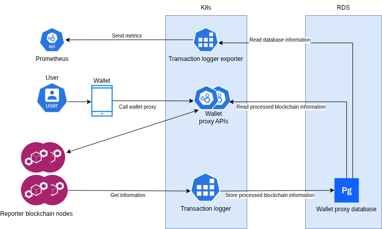

# Transaction logger

Log affected accounts and smart contracts into a postgres database.

## Component Interaction Diagram

The transaction logger is a blockchain indexer that collects transaction data and stores it in a PostgreSQL database. This data enables wallets to access historical transaction information. Wallets retrieve this data via the [wallet-proxy API](https://github.com/Concordium/concordium-wallet-proxy).



# Supported configuration options

- `TRANSACTION_LOGGER_NODES`
  List of nodes to query. They are used in order, and the next one is only used
  if querying preceding one failed. Must be non-empty. For example
  `http://localhost:20000,http://localhost:23000`

- `TRANSACTION_LOGGER_DB_STRING`
  Database connection string for the postgres database.
  For example `host=localhost dbname=transaction-outcome user=postgres password=password port=5432`

- `TRANSACTION_LOGGER_LOG_LEVEL`
  Log level. One of `off`, `error`, `warn`, `info`, `debug`. Default is `off`.

- `TRANSACTION_LOGGER_NUM_PARALLEL_QUERIES`
  Maximum number of parallel queries to make to the node. Usually 1 is the
  correct number, but during initial catchup it is useful to increase this to,
  say 8 to take advantage of parallelism in queries which are typically IO bound.

- `TRANSACTION_LOGGER_MAX_BEHIND_SECONDS` Maximum number of seconds since last
  finalization before a node is deemed behind is dropped upon a failed query. In
  such a case a new node is attempted.

- `TRANSACTION_LOGGER_CONNECT_TIMEOUT` Maximum number of seconds allowed for the
  initial connection to the node. Defaults to 10 seconds.

- `TRANSACTION_LOGGER_REQUEST_TIMEOUT` Maximum number of seconds allowed for
   each GRPC request to the node. Node that this counts time until first
   response, so streaming calls can take longer. Defaults to 60s.


# Failure handling

The service handles nodes disappearing or getting behind, as well as the
database connection being lost. The key design features of the service are

- Each block is written in a single database transaction. Thus any failure of
  the service leaves the database in an easily recoverable state. If a
  connection to the database is lost, the service will attempt to reconnect,
  with exponential backoff, up to 6 times.
- A list of nodes and their endpoints can be given. If querying a node fails,
  the next one in the list is attempted, in a round-robin fashion.

  The next node in the list is attempted in any of following cases
  - the node query fails due to network issues, or because the node failed to
    respond with the expected response
  - if the node is too far behind. This is currently determined by using the
    node's last finalized time as an indicator which is not perfect, although it
    should be sufficient. If this proves to be an unreliable test we could
    instead revise it to take into account
    - block arrival latency
    - time of the last finalized block

# Database format

The transaction logging can be used to construct additional indices that are not
needed for consensus and thus not provided by the node directly. The transaction
logger at the moment creates an index of transactions by affected account and
smart contract. This can be used for monitoring incoming transactions on an
account. Only finalized transactions are logged.

The database must exist before the logger starts.

If correct tables exist in the database then they will be used, otherwise the
[schema.sql](./resources/schema.sql) script will be executed to create the
tables and indices that are required.

There are two sets of tables. The first three tables, `ati`, `cti`, and
`summaries`, contain an index of transactions by account and contract address.
The `ati` and `cti` stand for **a**ccount, respectively **c**ontract,
**t**ransaction **i**ndex. They contain an index so that a transaction affecting
a given contract or account can be quickly looked up. The outcome of each
transaction is in the `summaries` table.

The summary that is stored in the `summary` column of the `summaries` table is stored as a JSON value. The contents is either of the form
```json
{
    "Left": ...
}
```
where `...` is a transaction outcome in the same format as it appears in block summaries, or
```json
{
    "Right": ...
}
```
where `...` is a special transaction outcome in the same format as it appears in block summaries.

The second set is the table of CIS2 tokens containing a list of all tokens that
were discovered, together with their total supply.

## Account transaction index

The meaning of the `(id, account, summary_id)` row in the `ati` table is that account `account` was affected by transaction pointed to by `summary_id`. **Affected** here means that either the account sent the transaction, or it was the target of it, for example another account sent a transfer to it. Note that accounts are stored in binary format, so as 32-byte arrays, and not in their Base58check encoding.

The data is written to the table upon each finalization from oldest to newest block finalized by that round.
For each block transactions are written in the order they appear in the block, that is, from start to end of the block.
The ids in all tables are automatically generated. Note that they should not be relied upon to be strictly sequential. Postgres does not guarantee this. It only guarantees that they will be strictly increasing, but there might be gaps.

The logger will never update any rows in the database, it only ever appends data to the tables.

## Contract transaction index

The meaning is analogous to the account transaction index, except here the logger logs transactions that affect smart contracts.

# Examples

## Most recent transactions

The database can be polled for transactions affecting a given account, for example to get the most recent transactions affecting an account a query like the following could be used

```sql
SELECT summaries.block, summaries.timestamp, summaries.summary
FROM ati JOIN summaries ON ati.summary = summaries.id
WHERE ati.account = $1
ORDER BY ati.id DESC LIMIT $2
```

where `$1` would be the given account address, and `$2` the number of desired transactions.

## Notifications

Postgres supports [Notifications](https://www.postgresql.org/docs/current/sql-notify.html) and [Listening](https://www.postgresql.org/docs/current/sql-listen.html) on channels. This can be used to replace polling for updates, in some cases, with subscriptions.

One way to achieve this is to register triggers on, `ati` and `cti` tables (or just one of them).
For example, a trigger that would send notifications to `listen_channel` for each row inserted into the `ati` table would look as follows.

```sql
CREATE FUNCTION pg_temp.notify_insert ()
RETURNS trigger
LANGUAGE plpgsql
as $$
BEGIN
  PERFORM (
    WITH summary AS
    (
      SELECT summaries.summary FROM summaries WHERE summaries.id = NEW.summary
    )
    SELECT pg_notify(TG_ARGV[0], summary::text) from summary
  );
  RETURN NULL;
END;
$$;

CREATE TRIGGER notify_on_insert_into_ati
AFTER INSERT
ON ati
FOR EACH ROW
EXECUTE PROCEDURE pg_temp.notify_insert('listen_channel');

LISTEN listen_channel;
```
Note that the use of the `pg_temp` schema means that these triggers will only apply to the current Postgres session, i.e., they will be dropped upon disconnect. If this is not desired then use a different schema (or no schema at all).

For each row that is inserted this will notify the `listen_channel` with the summary. Note that it is not guaranteed that there will be one notification for each insertion. If summaries are equal then Postgres is allowed to coalesce multiple notifications into one. To get one notification per insertion adjust the summary to include the row id, for example.

### Caveats

- Notifications are not queued if there are no listeners on a given channel. If the client disconnects and reconnects any insertions that happened during the time the client was offline will not be sent on the channel. Listeners must put additional recovery logic on top to make sure they do not miss events in such cases.

- Postgres has a limited buffer for notifications (by default 8GB). If the client that is listening is too slow in processing them then eventually this buffer will get full, and notifications will start being dropped.

- The size of a notification payload is limited to `8kB`, so notifications cannot be used as a general push mechanism. Instead they are best used to notify of events, so that the client knows to make relevant queries as a result. This might be more efficient if it replaces frequent polling for events that happen rarely.

# Contributing

[](https://github.com/Concordium/.github/blob/main/.github/CODE_OF_CONDUCT.md)

This repository's CI automatically checks formatting and common problems in rust.
Changes to any of the packages must be such that
- ```cargo clippy --all``` produces no warnings
- ```rust fmt``` makes no changes.

Everything in this repository should build with stable rust at the moment (at least version 1.60 and up), however the fmt tool must be from a nightly release since some of the configuration options are not stable. One way to run the `fmt` tool is

```shell
 cargo +nightly-2023-04-01 fmt
```
(the exact version used by the CI can be found in [.github/workflows/ci.yaml](.github/workflows/ci.yaml) file).
You will need to have a recent enough nightly version installed, which can be done via

```shell
rustup toolchain install nightly-2023-04-01
```
or similar, using the [rustup](https://rustup.rs/) tool. See the documentation of the tool for more details.

In order to contribute you should make a pull request and ask a person familiar with the codebase for a review.

## Building

The project is a pure Rust project, and can be build by running

```shell
cargo build --release
```

This produces a single binary `target/release/transaction-logger`.

**Make sure that you have checked and initialized submodules before the build**
e.g., using
```
git submodule update --init --recursive
```

### Running

To quickly get a PostgreSQL database instance running using [docker.io](https://www.docker.com/) the following command can be used:

```
docker run -p 5432:5432 -e POSTGRES_PASSWORD=password -e POSTGRES_DB="transaction-outcome" --rm postgres
```

The command to run the indexer with a remote node:

```
cargo run -- --node https://grpc.stagenet.concordium.com:20000 --db "host=localhost dbname=transaction-outcome user=postgres password=password port=5432" --log-level info
```

The command to run the indexer with a local node:

```
cargo run -- --node http://localhost:20000 --db "host=localhost dbname=transaction-outcome user=postgres password=password port=5432" --log-level info
```

### Database schema migrations

Database schema migration is handled in the [file](./src/migrations.rs).

When running the `transaction-logger` binary, it will check the current database schema version and execute all remaining database migrations until the `SchemaVersion::LATEST` is reached.

#### Introducing a new database schema version

Database schema files are tracked in the `./resources/` folder and every version of the database schema are represented by the `SchemaVersion` enum in [migration](./src/migrations.rs) logic.

- Extend the `SchemaVersion` enum with a variant representing changes since previous version.
- Extend functions found in `impl SchemaVersion`. Every required function should produce compile-time errors for the now missing variant.
- Enable the new schema by setting `SchemaVersion::LATEST` to the new variant.

### Docker build

A [Dockerfile](./Dockerfile) is available that produces a self-contained image
with the service installed and set as the entrypoint.

This docker image can be built using
```
docker build --build-arg build_image=rust:1.61-buster --build-arg base_image=debian:buster .
```
which produces a debian-buster based image.
